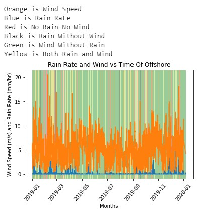

# Gary nguyen
# Meteorology Instrument 
## A) Link To the Code file: 
[The Code](https://colab.research.google.com/drive/1McaI9NyAp2Y94GeeBPkANeWrEnMDGMHQ)
## B) Introduction:
For this project, we will analyze the wind speed and rain rate in one year at two different Meteorology Instrument located at Oregon. From data collected, Cross correlation analysis method is used to determind the relationship between rain and wind at both location.
### Problem

Figure 1: Problem
## C) Results:
### 1. Rain Rate and Wind Speed in one Year
#### Oregon Shelf Surface Mooring

Figure 2: Rain Rate and Wind Speed vs Time of Shelf
#### Oregon Offshore Surface Mooring

Figure 3: Rain Rate and Wind Speed vs Time of Offshore
### 2. Average Rain Rate and Wind Speed
#### Oregon Shelf Surface Mooring

Figure 4: Average Rain Rate and Wind Speed vs Time of Shelf

Figure 5: Average Rain Rate of Shelf
#### Oregon Offshore Surface Mooring

Figure 6: Average Rain Rate and Wind Speed vs Time of Offshore

Figure 7: Average Rain Rate of Offshore
### 3. Correlation
#### Rain

Figure 8: Average Rain Rate of Offshore
#### Wind

Figure 9: Average Rain Rate of Offshore
## D) Conclusion
### Answer Question
5) (Wind Speed) What is the highest correlation? What is the time lag?
> max correlation is at lag -187 max correlation is: 0.269
6) (Rain Rate) What is the highest correlation? What is the time lag?
> max correlation is at lag -238, max correlation is: 0.217
7) Is there any relationship between the time lag of wind speed and rain rate?
> From data collected and correlation calculated, there is a relationship bettween Shelf and Offshore showed in both rain rate and wind speed. As the data calculated, both rain rate and wind speed are have around 0.2 time gap and lag at around 200. From that, we can tell that there is a delay between one and the other. If there is rain at one location, the other will also get rain for a moment later. Even though the lag is not 1, which they have rain and/or wind instantaneously, lag equal around 0.2 tells us that they located away from each other for a specific distances. If we know the real distance between them, we could make better weather map with more accurate.
8) From the average plots of rain rate and wind speed.

•Which month had the highest rain rate? Which month had the lowest rain rate? 

> At shelf, maximun rain rate is at February and minimun is at August

> At Offshore, maximun rain rate is at December and minimun is at July

•Which month had the highest wind speed? Which month had the lowest wind speed?

> At shelf, maximun wind speed is at January and minimun is at August

> At Offshore, maximun wind speed is at October and minimun is at September

## E) Reference:
Source: https://oceanobservatories.org/instrument-series/metbka/
Correlation: https://currents.soest.hawaii.edu/ocn_data_analysis/_static/SEM_EDOF.html
